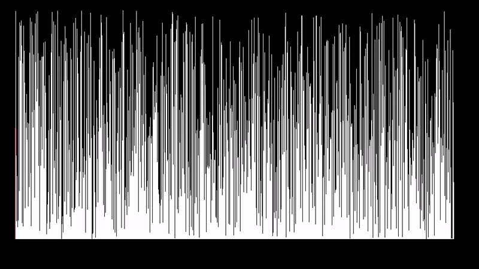
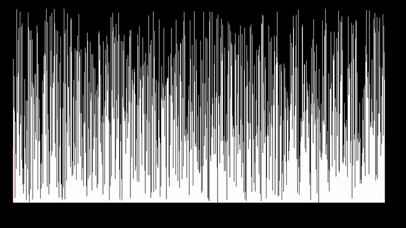

# Sorting Animated

Welcome to the **Sorting Animated** project! This project visualizes various sorting algorithms through animations.

## Algorithms

### Selection Sort

### Merge Sort

### Bubble Sort

### Selection Sort

## About
This project aims to help you understand how different sorting algorithms work by providing visual representations of their processes.

## Contributing
Feel free to contribute by adding more sorting algorithms or improving the existing animations.

## License
This project is licensed under the MIT License.